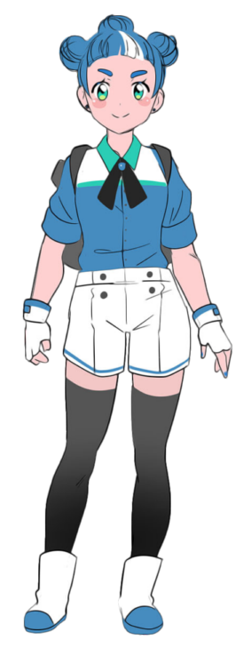

# 원본 캐릭터 이미지

# 작업 경과 이미지
준비중..

# 캐릭터 정보
2D Sprite Shader Demo 버전에 등장하는 godotea 캐릭터입니다.
작업자가 고도 엔진인 것으로 보아 곧 공식 캐릭터가 되려는게 아닌가 싶습니다.
그러나 이름 검색으로 추가적인 내용이 검색되지 않아 직접 작업해보기로 하였습니다. 별 다른 의도는 없습니다.

## License
2차 창작 라이선스가 붙을 수 있다면 CC BY 3.0 적용합니다. 원작자(Godot Engine)에게 시작 권한이 있고 별도의 상의 없이 예정을 한 것이기에 실제로 적용되지 않을 수도 있습니다.

이 예제에 사용되는 코드들은 GD스크립트 공부를 시작한지 얼마 안되어 만든 것이기 때문에 솔직히 효율이 많이 떨어질 가능성이 있습니다.  MIT 라이선스를 적용합니다.

향후 내용 수정
